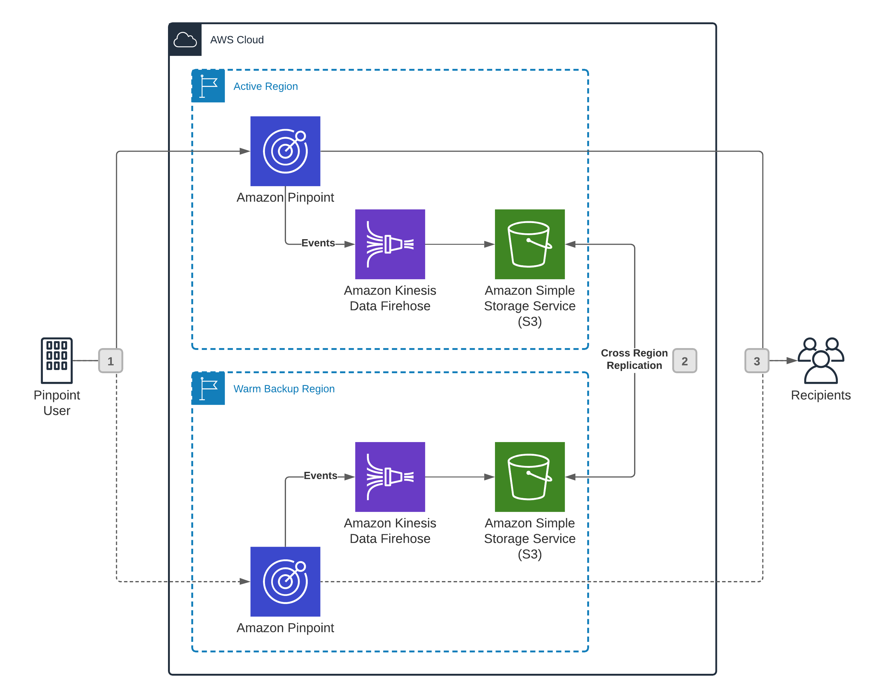
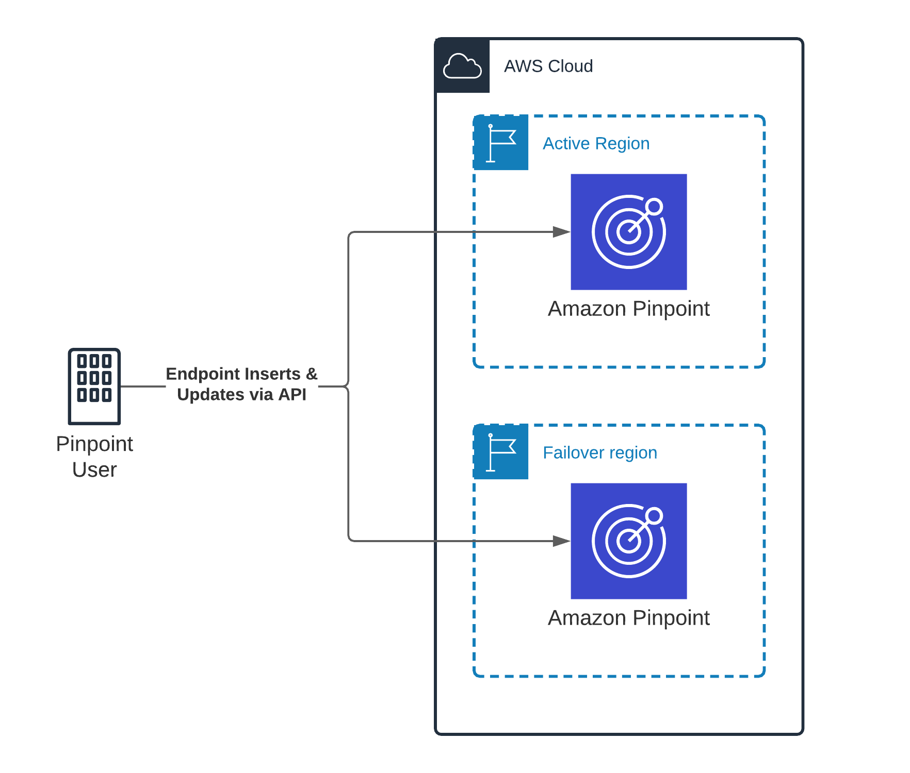
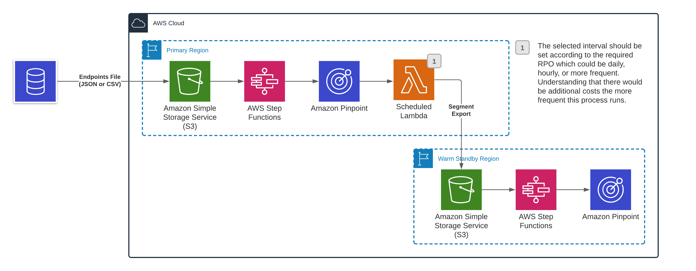
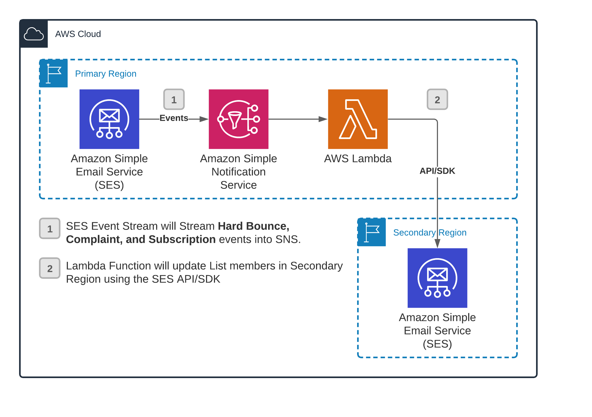
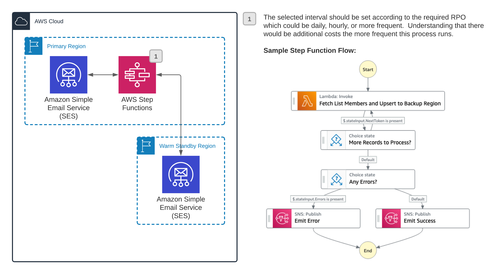
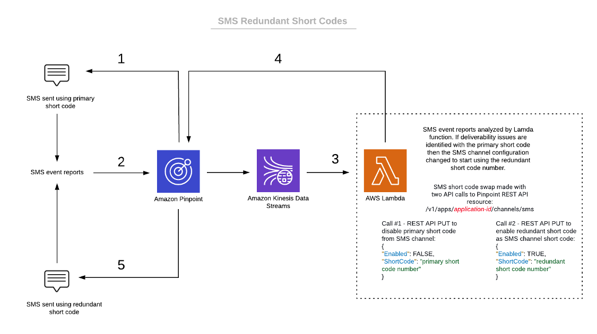

# Pinpoint and SES - Multi-Region Failover

## TL;DR;

* This contains high-level recommendations, work with your account team and Solution Architects to determine if a multi-region architecture is needed and what it looks like for your specific AWS architecture.
* **Email:** if Dedicated IPs are required and you are sending a high volumes (millions) then Active-Active is the only choice. If the share IP pool is acceptable in a disaster recovery scenario then the Warm Standby option is a simpler option.

## Overview

The following document will walk through several reference architectures for resilient communications using SES and Pinpoint.  For an excellent overview of disaster recovery at AWS and related terminology, please review the [AWS Disaster Recovery Workshop](https://disaster-recovery.workshop.aws/en/)

The [Reliability Pillar](https://docs.aws.amazon.com/wellarchitected/latest/reliability-pillar/welcome.html) of the  [Well Architected Framework](https://aws.amazon.com/architecture/well-architected/?wa-lens-whitepapers.sort-by=item.additionalFields.sortDate&wa-lens-whitepapers.sort-order=desc) is another excellent resource. 

**Note:** This document is a high-level overview of multi-region architectures as they relate to Pinpoint and SES.  It is not meant to be a document that covers multi-region architectures for an entire AWS workload.  Customers may also have Pinoint and SES requirements which impact their specific multi-region architecture.

**Any customer considering a multi-Region approach should engage deeply with their account teams and solutions architects (SAs) so they can help them assess their application's resiliency posture and share some best practices we have learned from working with customers who successfully run applications using multiple Regions.**

## Do you need a Multi-Region architecture?

We believe that for the vast majority of customer workloads, the highly resilient regional design of AWS is the best way for customers to achieve their availability goals. Operating across multiple AZs within a Region is a best practice and allows customers to achieve very high availability, including the ability to maintain availability during the vast majority of events. This is how Amazon.com has run and still runs today.

That said, we do think it's important for customers to carefully architect to avoid single points of failure. Customers with very high availability requirements (for example, mission-critical applications that cannot tolerate any downtime) can use AWS across multiple Regions to provide further resiliency against regional failures. Determining the right design requires understanding an application's business criticality, dependencies, workload volumes, and the nature of the work it performs. We have customers with workloads that operate with multi-Region resiliency on AWS, and these customers have achieved extremely high availability. This approach requires customers to make deeper investments to build their applications and regularly test their failover capabilities.

## Email and SMS Considerations

**Why does this document mention Simple Email Services(SES) along with Pinpoint?**
A majority of this document discusses Pinpoint, however when talking about sending email, Pinpoint actually uses SES to send emails.  That being said, any multi-region Pinpoint architectures regarding the email channel also apply to SES.  Any notable differences will be called out in the document.

**Note:** Sending Email and SMS requires working with Internet Service Providers, Cellular carriers, aggregators, and partners.  These external entities add additional considerations which need to be factored into any multi-region architecture.

### Email Considerations

 Internet Service Providers (ISPs) base email sending reputation on a couple of different factors:

* **Domain or Sub-Domain reputation** - This is less of an issue in a multi-region architecture as the same domains can be configured across regions and DKIM configuration can also be duplicated across regions, but it will require multiple DNS records.
* **IP Reputation** - In addition to Domain Reputation, ISPs also monitor which IP Addresses email traffic is coming from.  This is the primary consideration when selecting a multi-region architecture.  Pinpoint/SES allows for 2 different types of IP Addresses and there are several factors to consider when selecting an IP Address (see [Using Dedicated IP Addresses with SES](https://docs.aws.amazon.com/ses/latest/DeveloperGuide/dedicated-ip.html) for more information):
    * **Shared IP Address** - Emails are sent from IP addresses that are shared with other Amazon SES/Pinpoint users. Customers using the Shared IP Address pool have more options to consider when implementing a multi-region architecture as IP reputation is less of a concern.
    * **Dedicated IP Address** - Emails are sent from IP addresses dedicated to a single customer and dedicated IPs are attached to a single account and region.
        
         Customers who have elected to use Dedicated IPs can have large sending volume, sensitivity to shared sending reputation, or need to allow-list specific IPs for security reason are likely to be more sensitive to regional failures.
        
        When using Dedicated IPs, ISPs expect to see [predictable and consistent](https://docs.aws.amazon.com/ses/latest/DeveloperGuide/dedicated-ip.html#dedicated-ip-sending-patterns) sending from an IP Address.  Since Dedicated IP addresses are specific to single AWS Account and Region, independent set of IPs are required for each region in question. Imagine things from an ISP perspective when a bulk of the sending through the year comes from a pool of Dedicated IP Addresses, and during a fail-over scenario that traffic shifts to a different set of cold IP addresses.  To an ISP, this can look suspicious.
        
        SES offers the ability to [Auto Warm IP addresses](https://docs.aws.amazon.com/ses/latest/DeveloperGuide/dedicated-ip-warming.html), however this process can take 30-45 days, during which any additional volume that the IP wasn't "ready for" yet is sent via Shared IPs.  **In order to maintain predictable and consistent sending from a warmed Dedicated IP address, customers should implement an** [**Active-Active multi-region architecture**](#pinpoint-ses-active-active)**.**  

### SMS Considerations

When sending SMS messages the following factors should be taken into account when deciding on a multi-region strategy:

* **Origination Numbers (Long Code/Toll Free Number/10DLC/Short Code) are tied to an Account and Region.**  Any multi-region architecture will need to have origination numbers defined in each region.
    
    **Note:** this only applies if you have numbers provisioned to an account (required in the U.S.). If sending outside of the US using Pinpoint’s shared numbers, then this shouldn’t be a concern and you can shift traffic to other region without a change in configuration.
    
    Depending on Sending volumes, multiple short codes may not be necessary.  If the SMS volume is low enough to support sending via 10DLC temporarily, then an alternate solution could be to have a Short Code defined in the primary region and 10DLC or Toll Free Numbers defined in the DR Region.  This isn’t ideal, but could be a lower cost option in a DR scenario.
* [**Sender IDs**](https://docs.aws.amazon.com/pinpoint/latest/userguide/channels-sms-originating-identities.html#channels-sms-originating-identities-sender-ids) - [Some countries](https://docs.aws.amazon.com/pinpoint/latest/userguide/channels-sms-countries.html) support Sender IDs which can be used in multiple regions which simplifies any HA Multi-region architecture if all of the target countries support Sender IDs.
* **Carriers can also have availability issues** - For critical workloads it’s important to have multiple origination numbers available, monitor for issues, and have the ability to switch to a different origination number or region with other origination numbers provisioned.  See [Using Multiple SMS Origination Numbers for Redundancy](#using-multiple-sms-origination-numbers-for-redundancy) for more information

### High Availability Concepts

*(From: https://disaster-recovery.workshop.aws/en/intro/disaster-recovery.html)*

* **RTO** - Recovery Time Objective (RTO) is the maximum acceptable delay between service interruption and service restoration. This determines what is considered an acceptable time window when the service is unavailable.
* **RPO -** Recovery Point Objective (RPO) is the maximum acceptable time since the last data recovery point. This determines what is considered an acceptable loss of data between the last recovery point and the service outage.
* **Backup & Restore** - (RPO in hours, RTO in 24 hours or less): Back up your data and applications in the DR. Region Restore this data when needed to recover from a disaster.
* **Pilot Light** - (RPO in minutes, RTO in hours): Keep a minimal version of an environment by always running the most critical core elements of your system in the DR. region At the time of performing the recovery, you can quickly provision a full-scale production environment that includes that critical core.
* **Warm Standby** - (RPO in seconds, RTO in minutes): Keep a reduced version of a fully functional environment always running in the DR region. Business critical systems are fully duplicated and are always on, but with a reduced fleet. When the time comes for recovery, the system scales quickly to process the production load.
* **Active-Active** -  (RPO is none or possibly seconds, RTO in seconds): Your workload is deployed and actively serves traffic from multiple AWS regions. This strategy requires you to synchronize users and data between the regions you’re using. When recovery time comes, use services such as Amazon Route 53 or AWS Global Accelerator to route user traffic to the entire workload location.

In this document we are focusing on Highly Available and Resilient sending, so we will focus on Warm Standby and Active-Active Architectures.

## Pillars for Resilient Workloads

*(From: https://disaster-recovery.workshop.aws/en/intro/disaster-recovery/architecture-pillars.html)*

* **[Infrastructure-AS-Code](https://docs.aws.amazon.com/whitepapers/latest/introduction-devops-aws/infrastructure-as-code.html)** - Ensure your architecture is replicable in an automated way, making it possible to create and recreate this environment elsewhere, as well as giving visibility to changes through code versioning tools such as Git
* **Data Movement** - Data is serious. This means that the trend is that all the services required to manipulate this data are as close as possible to your repository. Questions such as latency, volumetry, costs and way of access to this data should be considered, planning specific forms of movement if necessary.
* **Application Architecture** - Conceive workloads that ensure low coupling between components, do not maintain state, communicate asynchronously and ensure the persistence and integrity of data in external repositories. In this way, it is possible for your application to move without impact to users or data being manipulated

When considering multi-region architectures it will be important (but not required) to implement an infrastructure-as-code approach.  While you can manually configure Pinpoint and SES across multiple regions that gets complicated to manage as more service are utilized. Having a repeatable way to deploy and update AWS services will make sure configurations remain consistent across regions.

Both Pinpoint and SES have CloudFormation (CF) support with the following exceptions:

* **Pinpoint Journeys** - Journeys do not currently have full parity CF support, but they can be managed via the Pinpoint API and Custom CF Resources which use Lambdas to configure Journeys via the API.
* **SMS Origination Numbers** - Phone numbers  (Long Code, TFN, 10DLC, Short Codes) cannot currently be configured via CF or API, so these will need to configured manually in the console.

## When to Failover?

Customers may want to fail over to an alternate region for several reasons:

* Issues accessing Pinpoint/SES console during a regional outage.
* Synchronous API faults after some level of [exponential backoff](https://docs.aws.amazon.com/general/latest/gr/api-retries.html). 
* Issues with Asynchronous delivery of email or SMS
    * [Email Delivery Delays](https://docs.aws.amazon.com/ses/latest/dg/event-publishing-retrieving-firehose-contents.html#event-publishing-retrieving-firehose-delivery-delay-object) - Note: Customers should not fail over due to delivery delay related to an ISP outage, as the same issue will manifest in the other SES region.
    * [SMS Carrier Availability Issues](#pinpoint-ses-active-active)
* Lack of event notifications in general (e.g. low volume or missing data alert)

Pinpoint and SES can be configured to send metrics to CloudWatch so alerts can be created for the scenarios above:

* [Pinpoint CloudWatch Alerts](https://docs.aws.amazon.com/pinpoint/latest/userguide/monitoring-create-alarms.html)
* [SES CloudWatch Metrics](https://docs.aws.amazon.com/ses/latest/dg/event-publishing-retrieving-cloudwatch.html)
* [Using Amazon CloudWatch Alerts](https://docs.aws.amazon.com/AmazonCloudWatch/latest/monitoring/AlarmThatSendsEmail.html)
* [CloudWatch Alerts for Missing Data](https://docs.aws.amazon.com/AmazonCloudWatch/latest/monitoring/AlarmThatSendsEmail.html#alarms-and-missing-data)

## Pinpoint/SES Active-Active

### Architecture

1. Pinpoint/SES traffic is equally split across both active regions.  If there are [excessive errors](#when-to-failover-) in one region after some [exponential backoff](https://docs.aws.amazon.com/general/latest/gr/api-retries.html) then all traffic should be routed to the other region.  This could also be a manual configuration to switch traffic to a single region. Note the following configurations will need to be consistent across regions:
    1. **Email Identities** (From Domain) - Any sending domains will need to be verified and properly configured across different regions.  This will require multiple DNS records to verify the domains for the different regions.
    2. **SMS Origination Numbers** (Long Code, TFN, 10DLC, Short Code) - If SMS origination numbers are provisioned to an account, then equivalent numbers to support failover volume will need to be provisioned in the other region.
        
        **Note:** this only applies if you have numbers provisioned to an account (required in the U.S.). If sending outside of the US using Pinpoint’s shared numbers, then this shouldn’t be a concern and you can shift traffic to other region without a change in configuration.
        
2. Pinpoint also generates event data (Opens, Clicks, Bounces, etc). If event streaming is enabled then this data should also be replicated across regions so it isn’t lost.  Using Kinesis Data Firehose along with S3 Object replication is one way to do this.  
    
    **Note:** S3 isn’t the only destination for Kinesis streams and this just represents one possible data replication option.  It’s also possible to write to Redshift, which also supports cross-region replication (in preview.)  SES also allows for event data to be written to SNS and CloudWatch.  Depending on the requirements for using this event data it will be important look at the services consuming this data and any potential cross-region architectures associated with those services.
3. SMS/Email is delivered to final recipients.

#### Advantages

* Email’s volume is constantly split across different IP addresses so any impacts to sending reputation based on IP address are minimized.  This is really the only viable option when sending high volumes of email using dedicated IPs
* RPO and RTO are minimized as failover can happen within seconds.

#### Disadvantages

* Customer will need to have additional logic in their code to perform exponential backoff (always a good idea) and logic to monitor for errors and fail over to alternate region.
* Configuration needs to be duplicated across regions, although Infrastructure as Code via CloudFormation templates will allow for a consistent and repeatable configuration.

## Pinpoint/SES Warm Standby

### Architecture

1. Pinpoint/SES traffic is sent to Primary region  If there are [excessive errors](#when-to-failover-) in primary region after some [exponential backoff](https://docs.aws.amazon.com/general/latest/gr/api-retries.html) then all traffic should be routed to the other region.  This could also be a manual configuration to switch traffic to a single region. Note the following configurations will need to be consistent across regions:
    1. **Email Identities** (From Domain) - Any sending domains will need to be verified and properly configured across different regions.  This will require multiple DNS records to verify the domains for the different regions.
    2. **SMS Origination Numbers** (Long Code, TFN, 10DLC, Short Code) - If SMS origination numbers are provisioned to an account, then equivalent numbers to support failover volume will need to be provisioned in the other region.
        
        **Note:** this only applies if you have numbers provisioned to an account (required in the U.S.). If sending outside of the US using Pinpoint’s shared numbers, then this shouldn’t be a concern and you can shift traffic to other region without a change in configuration.
        
2. Pinpoint also generates event data (Opens, Clicks, Bounces, etc). If event streaming is enabled then this data should also be replicated across regions so it isn’t lost.  Using Kinesis Data Firehose along with S3 Object replication is one way to do this.  
    
    **Note:** S3 isn’t the only destination for Kinesis streams and this just represents one possible data replication option.  It’s also possible to write to Redshift, which also supports cross-region replication (in preview.)  SES also allows for event data to be written to SNS and CloudWatch.  Depending on the requirements for using this event data it will be important look at the services consuming this data and any potential cross-region architectures associated with those services.
3. SMS/Email is delivered to final recipients.

#### Advantages

* Good option when using the Shared SES IP Pool as traffic doesn’t need to be continually distributed across IPs in order to maintain Sending IP Reputation.

#### Disadvantages

* Customer will need to have additional logic in their code to perform exponential backoff (always a good idea) and logic to monitor for errors and fail over to warm standby region.
* Configuration needs to be duplicated across regions, although Infrastructure as Code via CloudFormation templates will allow for a consistent and repeatable configuration.

## Importing Recipients

For both Active-Active and Warm Standby scenarios its important to consider how Endpoints/Users are kept consistent across regions.  This largely depends on the system of record and how user data is initially populated into a single region.

**In order to keep User IDs and Endpoint ID’s consistent across regions it will be necessary to specify the User ID’s and Endpoint IDs.  If an Endpoint ID isn’t specified then Pinpoint will generate a unique ID for that Endpoint.  This will make it difficult to correlate event data if traffic is split across regions as Endpoints would have different IDs**

### SES Considerations

SES supports an [Account Level Suppression List](https://docs.aws.amazon.com/ses/latest/dg/sending-email-suppression-list.html) and also [List and Subscription Management](https://docs.aws.amazon.com/ses/latest/dg/sending-email-list-management.html).  When using these features, customers will need to implement a cross-region replication solution to provide a seamless failover.  Both features have API/CLI support to retrieve and update users.  A sample replication process [can be found below](#ses-list-replication).

### API

When managing endpoints via the Pinpoint API it will be important to make sure endpoints are added/updated in both regions:

### Batch via S3

If managing Pinpoints via exports from an Customer System of Record or AWS Datalake into and S3 bucket they will also need to be replicated to the alternate regions.

For Active-Active and Warm Standby this can be done in parallel by writing the Endpoint CSV/JSON files to multiple S3 buckets and implementing the following reference architecture to import the endpoints based on seeing the file dropped to S3:
https://github.com/aws-samples/digital-user-engagement-reference-architectures#amazon-s3-triggered-endpoint-imports

If just using a Warm-Stand by architecture, you could also consider having a recurring export of endpoints from the primary region into the warm standby region by exporting segments out of the primary region into an S3 bucket in the standby region and again using the reference architecture above to import the file when it’s dropped on S3:

### SES List Replication

#### Event Based (Near Realtime)

Using the SES Event Stream you can monitor for Hard Bounce, Complaint and Subscription events so that other regions can be kept in sync. In an Active-Active a similar process should be implemented in the other direction to keep both regions in sync.

#### Batch

The following demonstrates an example architecture to replicate SES Account Level Supression or Subscription Lists to another region.  In an Active-Active a similar process should be implemented in the other direction to keep both regions in sync.

## Using Multiple SMS Origination Numbers for Redundancy

Pinpoint’s SMS message delivery occurs over mobile systems utilizing multiple partners and networks. Amazon Web Services recommends procuring a minimum of two origination numbers (Long Code, Toll-Free Number, 10DLC, Short Code) to avoid a potential single point of failure from utilizing one. A region can have multiple origination numbers and each number is tied to one region within an AWS account.

**Note:** [Some countries](https://docs.aws.amazon.com/pinpoint/latest/userguide/channels-sms-countries.html) support [**Sender IDs**](https://docs.aws.amazon.com/pinpoint/latest/userguide/channels-sms-originating-identities.html#channels-sms-originating-identities-sender-ids) which can be used in multiple regions which simplifies any HA Multi-region architecture if all of the target countries support Sender IDs.

Pinpoint event processing should be implemented to confirm the status of SMS deliveries from each origination number. If there is a delivery-impacting event on for a number, messages can be retried on an alternative number.
https://docs.aws.amazon.com/pinpoint/latest/developerguide/event-streams.html

### Architecture

The following architecture demonstrates changing the Pinpoint SMS configuration to use a different origination number at a project level.  When using the SendMessage API, you can also change which origination number is used if you detect carrier issues.

### Documentation References

* [Streaming Amazon Pinpoint Events to Kinesis](https://docs.aws.amazon.com/pinpoint/latest/developerguide/event-streams.html)
* [SMS Event Types and Error Statuses](https://docs.aws.amazon.com/pinpoint/latest/developerguide/event-streams-data-sms.html)
* [SMS Channel API](https://docs.aws.amazon.com/pinpoint/latest/apireference/apps-application-id-channels-sms.html)
* [Passing Origination Number using the SendMessage API](https://docs.aws.amazon.com/pinpoint/latest/apireference/apps-application-id-messages.html#apps-application-id-messages-prop-smsmessage-originationnumber)

