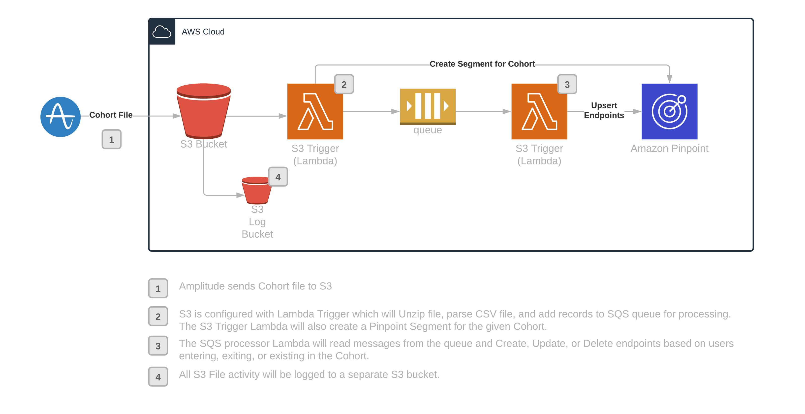

# Amplitude and Pinpoint Cohorts Integration Application

This SAM application provides infrastructure to toake Amplitude user cohort export files in a S3 bucket, and import them into a Pinpoint project.

## Architecture

## Data Retention Considerations
Note that the files written to S3 in the architecture would remain indefinitely.  It's recommended that you implement S3 Lifecycle policies to remove these files based on your particular information security and data retention requirements.  See [Managing your storage lifecyle](https://docs.aws.amazon.com/AmazonS3/latest/userguide/object-lifecycle-mgmt.html) for more information.

## Prerequisites
* [A Pinpoint Project](https://docs.aws.amazon.com/pinpoint/latest/userguide/gettingstarted-create-project.html)
* AWS CLI - [Install the AWS CLI](https://aws.amazon.com/cli/).
* Node.js - [Install Node.js 12](https://nodejs.org/en/), including the npm package management tool.
* S3 Bucket for Build Deployments

# Setup Steps

## 1. Set up a Pinpoint Project

If you do not have a Pinpoint project, create one in the AWS console.  Instructions are [here](https://docs.aws.amazon.com/pinpoint/latest/userguide/projects-manage.html).  Once you have your project set up, get its project ID, you will need it in step 2.

## 2. Deploy this Integration

* Clone the Github repo: git clone [https://github.com/davelemons/amplitude-sam.git](https://github.com/aws-samples/communication-developer-services-reference-architectures.git)
* Change into this directory: `cd communication-developer-services-reference-architectures/integrations/amplitude-sam`
* Package the integration SAM package to an S3 bucket in your account:  `aws cloudformation package --template template.yml --s3-bucket [S3 Deployment Bucket] --output-template template-export.yml`  (Note that the package bucket should be created in the AWS region in which you plan to run your integration)
* Deploy the integration via AWS CLI:  `aws --region [your region] cloudformation deploy --template-file template-export.yml --stack-name amplitude-sam --capabilities CAPABILITY_IAM --parameter-overrides PinpointProjectId=[Pinpoint Project/Application ID] FileDropS3Bucket=[S3 Bucket Name]`

## 3. Sync your cohorts to Amazon S3 using the S3 integration in Amplitude. 

Amplitude cohort instructions are [here](https://help.amplitude.com/hc/en-us/articles/360051952812-Sync-Amplitude-cohorts-to-Amazon-S3).

* You will need to configure the sync to go to the bucket you specified above
* Your Amplitude CSV file will need to contain at least a name and email field; entries in the export without these fields will be ignored
* As Amplitude updates your cohort and exports it to S3, the integration Lambda will update your segment in Pinpoint
