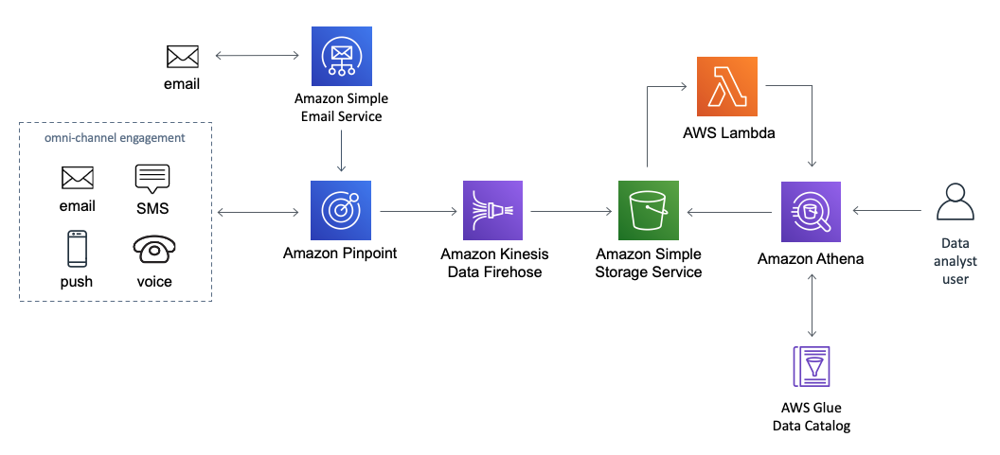
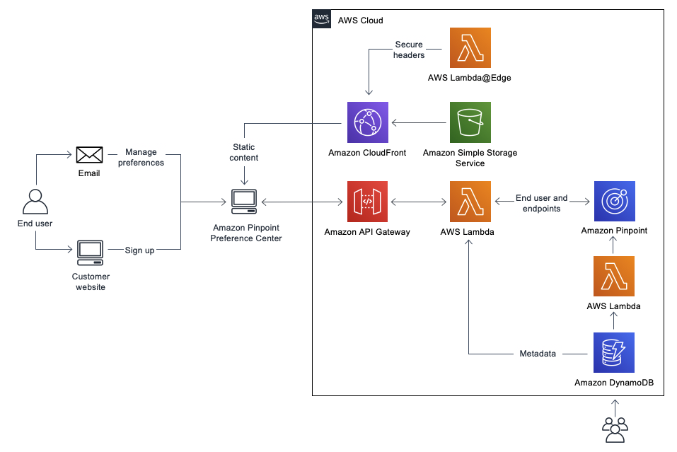
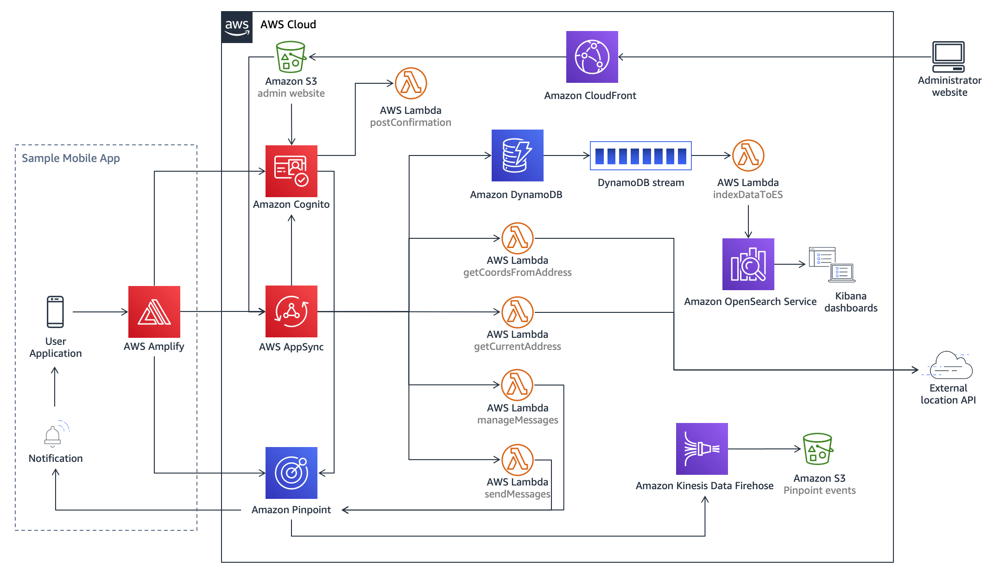

# Amazon Pinpoint Solutions
Organizations today are in search of vetted solutions and architectural guidance to rapidly solve business challenges. Whether customers prefer off-the-shelf deployments, or customizable architectures, The Pinpoint and SES solutions below are architectures that can be deployed directly to an account using CloudFormation templates.  Each solution has gone through a Well-Architected and Security review.

## Table of Contents
* [Digital User Engagement Events Database](#digital-user-engagement-events-database)
* [Amazon Pinpoint Preference Center](#amazon-pinpoint-preference-center)
* [Predictive Segmentation Using Amazon Pinpoint and Amazon SageMaker](#predictive-segmentation-using-amazon-pinpoint-and-amazon-sagemaker)
* [Predictive User Engagement](#predictive-user-engagement)
* [Location-Based Notifications Using Amazon Pinpoint]
(#location-based-notifications-using-amazon-pinpoint)
* [IoT Channel Using Amazon Pinpoint](#iot-channel-using-amazon-pinpoint)

## Digital User Engagement Events Database

### Architecture

### Overview
Customers want to stay connected to their favorite businesses and brands. They loyally follow the latest products, news, and promotions through a variety of online and offline channels. They expect businesses and brands to understand them uniquely and communicate to them with relevant and timely messaging. Rising to meet these expectations, modern data-driven marketers look to data to understand their customers to deliver the right message, on the right channel, at the right time. These marketers require messaging tools that can execute across multiple channels at scale and analytics tools to gain insights from customer engagement.

Amazon Simple Email Service (Amazon SES) and Amazon Pinpoint provide customers powerful tools to orchestrate and deliver communications using email, SMS, voice, and mobile push channels. In addition to providing rich dashboards showing aggregate engagement data, both Amazon SES and Amazon Pinpoint allow you to stream engagement events in real-time to Amazon Kinesis. These events include email sends, email opens, email clicks, email bounces, email spam complaints, SMS sends, SMS failures, SMS opt outs, and custom application events.

The Digital User Engagement Events Database solution is a reference implementation that automatically provisions and configures the AWS services necessary to start analyzing the real-time stream of engagement data from Amazon SES and Amazon Pinpoint using Amazon Athena. The deployed event database follows best practices and can be queried directly by data analysts or pulled into visualization tools like Amazon QuickSight to create custom dashboards.

### Documentation References
- [Implementation Guide](https://docs.aws.amazon.com/solutions/latest/digital-user-engagement-events-database/overview.html)
- [Deployment Guide](https://docs.aws.amazon.com/solutions/latest/digital-user-engagement-events-database/deployment.html)
- [Github Repo](https://github.com/awslabs/digital-user-engagement-events-database)
- [Solution Page](https://aws.amazon.com/solutions/implementations/digital-user-engagement-events-database/?did=sl_card&trk=sl_card)

## Amazon Pinpoint Preference Center

### Architecture

### Overview
Amazon Pinpoint Preference Center guides Amazon Pinpoint customers in building a web application that helps end users to choose their communication preferences. By collecting communication preferences, Amazon Pinpoint customers can send targeted communications to their end users based on their preferred communication channels and interests.

Until now, Amazon Pinpoint customers had to develop their own preference centers or extract preference data from other systems to collect end user communication preferences. With Amazon Pinpoint Preference Center, customers now have a guidance that accurately segments their end users.

To address legal or regulatory requirements, for example, CAN-SPAM Act, this solution provides end users the option to opt out of receiving marketing communications.

### Documentation References
- [Implementation Guide](https://docs.aws.amazon.com/solutions/latest/amazon-pinpoint-preference-center/overview.html)
- [Deployment Guide](https://docs.aws.amazon.com/solutions/latest/amazon-pinpoint-preference-center/deployment.html)
- [Github Repo](https://github.com/awslabs/amazon-pinpoint-preference-center)
- [Solution Page](https://aws.amazon.com/solutions/implementations/amazon-pinpoint-preference-center/?did=sl_card&trk=sl_card)

## Predictive Segmentation Using Amazon Pinpoint and Amazon SageMaker

### Architecture

### Overview
Predictive Segmentation Using Amazon Pinpoint and Amazon SageMaker combines Amazon Pinpoint with Amazon SageMaker to help automate the process of collecting customer data and creating Amazon Pinpoint segments identified by Machine Learning (ML) for tailored audience messaging. These segments can include users predicted to churn, users predicted to make a purchase, and other predicted user behaviors relevant to your business needs.

This Guidance includes a sample dataset that you can use as a reference to develop your own custom ML models using your own data.

Deploying [Digital User Engagement Events Database](#digital-user-engagement-events-database) is a prerequisite to deploying this Guidance.

### Documentation References
- [Implementation Guide](https://docs.aws.amazon.com/solutions/latest/predictive-segmentation-using-amazon-pinpoint-and-amazon-sagemaker/overview.html)
- [Deployment Guide](https://docs.aws.amazon.com/solutions/latest/predictive-segmentation-using-amazon-pinpoint-and-amazon-sagemaker/deployment.html)
- [Github Repo](https://github.com/awslabs/predictive-segmentation-using-amazon-pinpoint-and-amazon-sagemaker)
- [Solution Page](https://aws.amazon.com/solutions/implementations/predictive-segmentation-using-amazon-pinpoint-and-amazon-sagemaker/?did=sl_card&trk=sl_card)

## Predictive User Engagement

### Architecture

### Overview
Predictive User Engagement provides a simple architecture that automates the process of making predictive recommendations based on user activity in Amazon Personalize, and updating Amazon Pinpoint endpoints with those recommendations.

This Guidance is designed to provide a simple architecture to demonstrate how to use ML to make product recommendations and automatically update your endpoints and segments. You can build upon this architecture for a variety of use cases.

### Documentation References
- [Implementation Guide](https://docs.aws.amazon.com/solutions/latest/predictive-user-engagement/overview.html)
- [Deployment Guide](https://docs.aws.amazon.com/solutions/latest/predictive-user-engagement/deployment.html)
- [Github Repo](https://github.com/awslabs/predictive-user-engagement)
- [Solution Page](https://aws.amazon.com/solutions/implementations/predictive-user-engagement/?did=sl_card&trk=sl_card)

## Location-Based Notifications Using Amazon Pinpoint

### Architecture

### Overview
The Location-Based Notifications Using Amazon Pinpoint guidance allows you to engage with your customers based on their location. You can use this guidance to create and manage geographic boundaries (geofences) around businesses or points of interest. These geofences help you customize your engagement campaigns by sending push notifications to your customers when they enter or exit a geofence. For example, you can send a notification when a customer is walking to meet their rideshare, or when they enter an airport to check-in for a flight.

This guidance provides the following features:

A new Amazon Pinpoint project with push notifications enabled (both iOS and Android devices are supported out-of-the-box)
An Amazon Cognito user pool created to provide authentication to the solution’s APIs and administration website
A secure administration website that enables you to quickly and easily manage geofences and create personalized message templates for each location
A Kibana dashboard to display analytics and provide near real-time feedback

### Documentation References
- [Implementation Guide](https://docs.aws.amazon.com/solutions/latest/location-based-notifications-using-amazon-pinpoint/overview.html)
- [Deployment Guide](https://docs.aws.amazon.com/solutions/latest/location-based-notifications-using-amazon-pinpoint/deployment.html)
- [Github Repo](https://github.com/awslabs/location-based-notifications-using-amazon-pinpoint)
- [Solution Page](https://aws.amazon.com/solutions/implementations/location-based-notifications-using-amazon-pinpoint/?did=sl_card&trk=sl_card)

## IoT Channel Using Amazon Pinpoint

### Architecture

### Overview
This solution combines Amazon Pinpoint with AWS Lambda to help automate the process of segmenting customers and sending targeted messages to their connected devices through an IoT channel. 

### Documentation References
- [Implementation Guide](https://docs.aws.amazon.com/solutions/latest/iot-channel-using-amazon-pinpoint/overview.html)
- [Deployment Guide](https://docs.aws.amazon.com/solutions/latest/iot-channel-using-amazon-pinpoint/deployment.html)
- [Github Repo](https://github.com/awslabs/iot-channel-using-amazon-pinpoint)
- [Solution Page](https://aws.amazon.com/solutions/implementations/iot-channel-using-amazon-pinpoint/?did=sl_card&trk=sl_card)